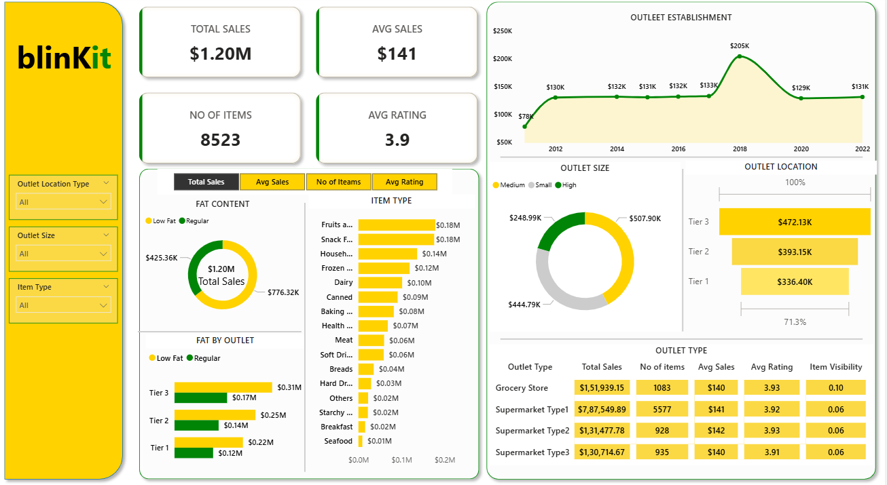

# 📊 Blinkit Grocery Sales Dashboard

## 🔹 Project Overview
This project presents an interactive sales dashboard built using Power BI to analyze Blinkit grocery sales data. The dashboard provides insights into sales performance, outlet distribution, and product category trends.

---

## 🔹 Tools & Technologies
- Power BI (DAX, Power Query, Data Modeling)
- Microsoft Excel

---

## 🔹 Dataset Information
- Total Sales: $1.20M
- Number of Items: 8,523
- KPIs: Total Sales, Average Sales, Average Rating
- Outlet Attributes: Size, Location Tier, Outlet Type
- Product Attributes: Item Type, Fat Content, Visibility

---

## 🔹 Key Insights
- Tier 3 outlets generated the highest revenue contribution.
- Identified top-performing product categories based on total sales.
- Compared outlet sizes (Small, Medium, High) for performance analysis.
- Tracked average sales and rating metrics for business evaluation.

---

## 🔹 Dashboard Features
- Interactive slicers for Outlet Size, Location, and Item Type
- KPI Cards for quick performance overview
- Donut charts, bar charts, and trend analysis visuals
- Outlet-wise and category-wise comparison

---

## 🔹 Dashboard Preview

## 👩‍💻 Author
Nandana C H  
Aspiring Data Analyst | Power BI | SQL | Python
